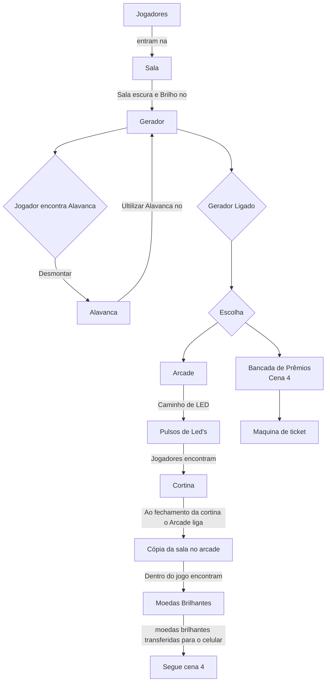

...

## Fluxograma

```mermaid
flowchart TD

A[Jogadores]
B[Sala]
C[Gerador]
D[Alavanca]
E{Jogador encontra Alavanca}
F{Escolha}
G[Arcade]
H[Bancada de Prêmios
Cena 4]
I[Pulsos de Led's]
J[Cortina]
K[Cópia da sala no arcade]
L[Moedas Brilhantes]
P{Gerador Ligado}
M[Segue cena 4]
N[Maquina de ticket]


A -->|entram na| B
B --> |Sala escura e Brilho no | C
C--> E
--> |Desmontar| D
--> |Ultilizar Alavanca no | C
--> P
--> F
F --> G
F --> H
--> N
G --> |Caminho de LED| I 
 --> |Jogadores encontram | J
J --> |Ao fechamento da cortina o Arcade liga  | K
--> |Dentro do jogo encontram | L

--> |moedas brilhantes transferidas para o celular| M


```