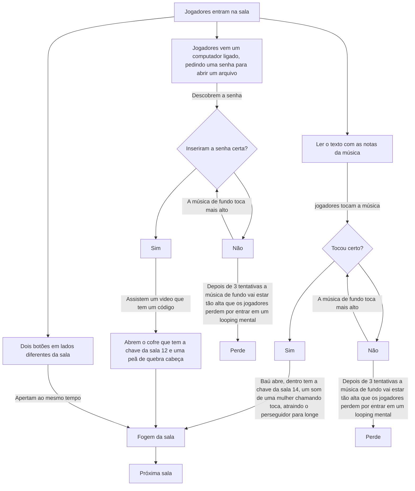

# Cena 1

Os jogadores entram na sala 14 sendo perseguidos, eles resolvem os enigmas, ativam um som e conseguem abrir um baú e um cofre, pegar as chaves e uma peça. 

## Fluxograma

```mermaid
flowchart TD
A[Jogadores entram na sala]
B[Ler o texto com as notas da música]
C{Tocou certo?}
D[Sim]
E[Não]
F[Fogem da sala]
G[Perde]
H[Jogadores vem um computador ligado, pedindo uma senha para abrir um arquivo]
I{Inseriram a senha certa?}
J[Sim]
K[Não]
L[Perde]
M[Abrem o cofre que tem a chave da sala 12 e uma peã de quebra cabeça]
N[Dois botões em lados diferentes da sala]
O[Próxima sala]

A --> B
A --> H
B--> |jogadores tocam a música| C
C --> D
C --> E
D--> |Baú abre, dentro tem a chave da sala 14, um som de uma mulher chamando toca, atraindo o perseguidor para longe| F
E --> |A música de fundo toca mais alto| C
E --> |Depois de 3 tentativas a música de fundo vai estar tão alta que os jogadores perdem por entrar em um looping mental| G
H --> |Descobrem a senha|I
I --> J
I --> K
K --> |A música de fundo toca mais alto| I
K --> |Depois de 3 tentativas a música de fundo vai estar tão alta que os jogadores perdem por entrar em um looping mental| L
J --> |Assistem um video que tem um código|M
M --> F
A --> N
N --> |Apertam ao mesmo tempo|F
F --> O
```