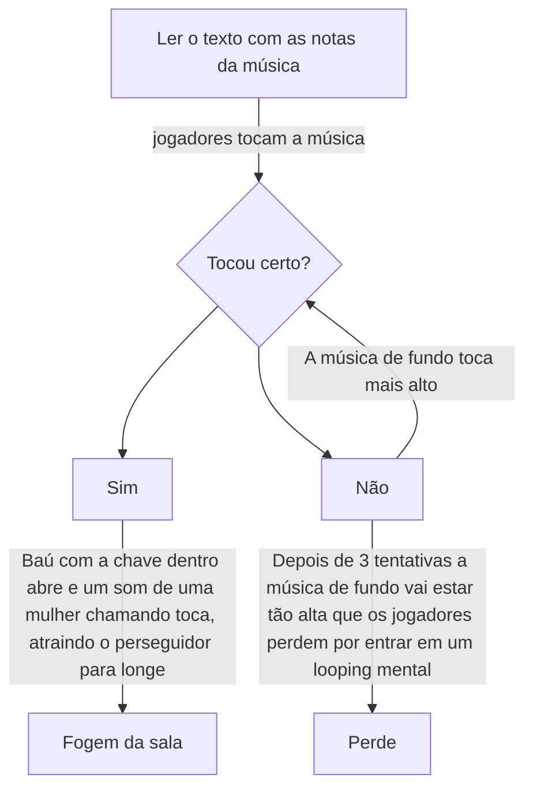

# Cena 1

Os jogadores entram na sala 14 sendo perseguidos, eles resolvem o enigma, ativam um som e conseguem abrir o baú e pegar a chave. 

## fluxograma

```mermaid
flowchart TD
A[Ler o texto com as notas da música]
B{Tocou certo?}
C[Sim]
D[Não]
E[Fogem da sala]
F[Perde]

A --> |jogadores tocam a música| B
B --> C
B --> D
C --> |Baú com a chave dentro abre e um som de uma mulher chamando toca, atraindo o perseguidor para longe| E
D --> |A música de fundo toca mais alto| B
D --> |Depois de 3 tentativas a música de fundo vai estar tão alta que os jogadores perdem por entrar em um looping mental| F
```