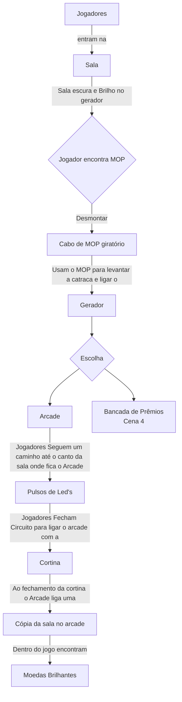

# Cena 3

...

## Fluxograma

```mermaid
flowchart TD

A[Jogadores]
B[Sala]
C[Gerador]
D[Cabo de MOP giratório]
E{Jogador encontra MOP}
F{Escolha}
G[Arcade]
H[Bancada de Prêmios
Cena 4]
I[Pulsos de Led's]
J[Cortina]
K[Cópia da sala no arcade]
L[Moedas Brilhantes]


A -->|entram na| B
B --> |Sala escura e Brilho no gerador| E
--> |Desmontar| D
--> |Usam o MOP para levantar a catraca e ligar o | C
--> F
F --> G
F --> H
G --> |Jogadores Seguem um caminho até o canto da sala onde fica o Arcade| I 
 --> |Jogadores Fecham Circuito para ligar o arcade com a | J
J --> |Ao fechamento da cortina o Arcade liga uma | K
--> |Dentro do jogo encontram | L


```