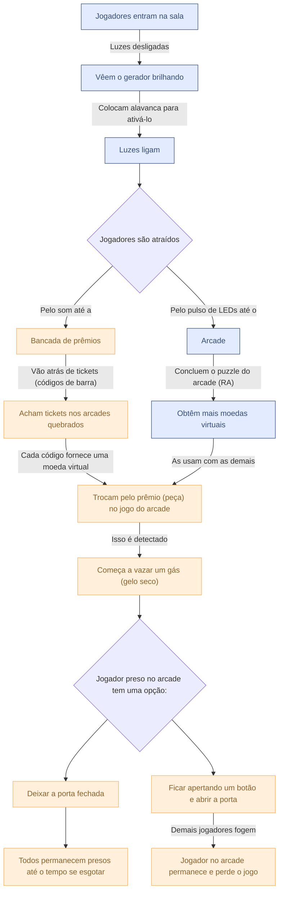

## Fluxograma da Cena 4 (Arcade)
No fluxograma, se encontram em azul as partes da sala desenvolvidas para a cena 3 (cena prévia). Já a cor amarela corresponde às partes pertencentes à cena 4:

```mermaid


---
config:
  layout: dagre
---
flowchart TD
    A["Jogadores entram na sala"] -- Luzes desligadas --> n1["Vêem o gerador brilhando"]
    n1 -- "Colocam alavanca para ativá-lo" --> n2["Luzes ligam"]
    n2 --> B{"Jogadores são atraídos"}
    B -- Pelo pulso de LEDs até o --> n3["Arcade"]
    B -- Pelo som até a --> n4["Bancada de prêmios"]
    n4 -- Vão atrás de tickets (códigos de barra) --> n5["Acham tickets nos arcades quebrados"]
    n3 -- Concluem o puzzle do arcade (RA) --> n10["Obtêm mais moedas virtuais"]
    n5 -- Cada código fornece uma moeda virtual --> n11["Trocam pelo prêmio (peça) no jogo do arcade"]
    n10 -- As usam com as demais --> n11
    n11 -- Isso é detectado --> n13["Começa a vazar um gás (gelo seco)"]
    n13 --> n14{"Jogador preso no arcade tem uma opção:"}
    n14 --> C["Deixar a porta fechada"] & D["Ficar apertando um botão e abrir a porta"]
    C --> E["Todos permanecem presos até o tempo se esgotar"]
    D -- Demais jogadores fogem --> n15["Jogador no arcade permanece e perde o jogo"]
     A:::Sky
     n1:::Sky
     n2:::Sky
     n3:::Sky
     n4:::Peach
     n5:::Peach
     n10:::Sky
     n11:::Peach
     n13:::Peach
     C:::Peach
     D:::Peach
     E:::Peach
     n15:::Peach
    classDef Sky stroke-width:1px, stroke-dasharray:none, stroke:#374D7C, fill:#E2EBFF, color:#374D7C
    classDef Peach stroke-width:1px, stroke-dasharray:none, stroke:#FBB35A, fill:#FFEFDB, color:#8F632D

```

