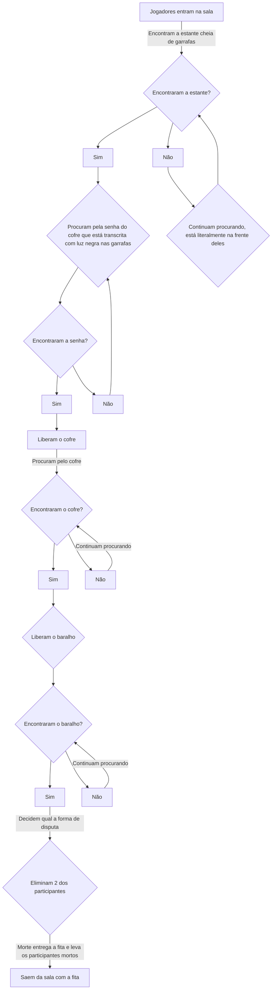

# Cena 5

## Fluxograma

```mermaid
flowchart TD

A[Jogadores entram na sala]
D{Procuram pela senha do cofre que está transcrita com luz negra nas garrafas}
E[Sim]
e[Sim]
F[Não]
f[Não]
G{Encontraram a estante?}
H{Continuam procurando, está literalmente na frente deles}
I{Encontraram a senha?}
J[Liberam o cofre]
K{Encontraram o cofre?}
e1[Sim]
e2[Não]
L{Liberam o baralho}
e3[Sim]
e4[Não]
M{Encontraram o baralho?}
O{Eliminam 2 dos participantes}
P[Saem da sala com a fita]

A --> |Encontram a estante cheia de garrafas| G
G --> E
G --> F
F --> H
E --> D
H --> G
D --> I
I --> e
I --> f
e --> J
f --> D
J -->|Procuram pelo cofre| K
K --> e1
K --> e2
e2 --> |Continuam procurando|K
e1 --> L
L --> M
M --> e3
M --> e4
e4 --> |Continuam procurando|M
e3 --> |Decidem qual a forma de disputa|O
O --> |Morte entrega a fita e leva os participantes mortos|P


```